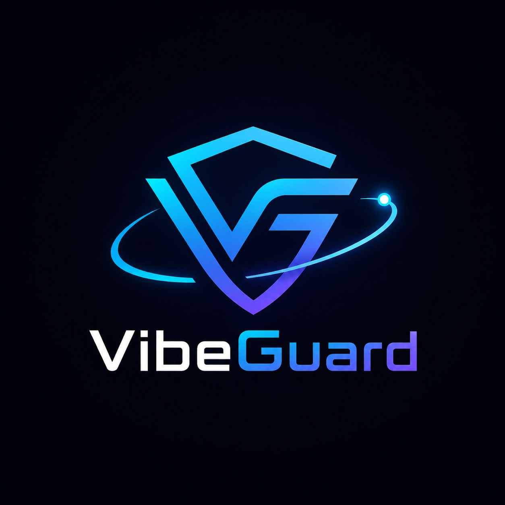

<p align="center">
  
</p>

# VibeGuard

> **Guardrails for vibe-coded software.**

VibeGuard is an open-source Python CLI that empowers AI-assisted developers to create cleaner project context, generate targeted prompts, bundle token-aware files, compile verification reports, audit Git diffs, detect risk patterns, and draft follow-up hardening instructions.

It is **not** an autonomous AI coding agent and **requires no LLM API keys**. VibeGuard operates locally, serving as a protective layer before you feed context to coding assistants (like Cursor, Claude, ChatGPT, Windsurf, Replit, or Codex) and after they modify your repository.

---

## 🎯 Positioning

* **Before AI codes:** Supply context packs and optimized prompt templates to maximize coding accuracy.
* **After AI codes:** Instantly verify changes, review Git diff summaries, and catch potential security or logical regressions.
* **Core benefits:** Save context tokens, catch risky AI-generated changes, and ship code with confidence.

---

## 🚀 Installation

### Global Isolated Installation (Recommended)
Install and run VibeGuard globally across all terminal sessions using `pipx`:
```bash
pipx install vibeguard
```

### Install for Development
Clone the repository and set up an editable installation inside a Python virtual environment:
```bash
git clone https://github.com/Sarthak702-droid/VibeGaurd.git
cd VibeGaurd
python3 -m venv .venv
source .venv/bin/activate
pip install -e .
```

---

## 💻 CLI Global Usage & Shortcuts

After installation, VibeGuard is accessible globally using either the full command or its short developer alias:
```bash
vibeguard [COMMAND] [OPTIONS]
# or
vg [COMMAND] [OPTIONS]
```

### Global Options
* `--version` / `-V`: Show the version and exit.
* `--help`: Show command documentation.

---

## 🔧 Command Reference

| Command | Alias | Description | Key Options |
| :--- | :--- | :--- | :--- |
| `init` | `vg init` | Initializes a `.vibeguard/` folder with a template config file. | `-p, --project <path>` |
| `doctor` | `vg doctor` | Diagnoses project health, CLI path issues, and tool chains. | `-p, --project <path>` |
| `scan` | `vg scan` | Detects technology stacks, frameworks, and important files. | `-p, --project <path>` |
| `context` | `vg context` | Creates an AI-readable context report based on project files. | `-g, --goal <str>`, `-p <path>`, `-t <tokens>` |
| `plan` | `vg plan` | Turns a rough concept into a structured implementation plan. | `-g, --goal <str>`, `-p <path>` |
| `prompt` | `vg prompt` | Generates a high-quality prompt tailored for your coding tool. | `-g, --goal <str>`, `-p <path>`, `-t <tokens>` |
| `pack` | `vg pack` | Packages relevant files into a single context file. | `-g, --goal <str>`, `-p <path>`, `-t <tokens>` |
| `verify` | `vg verify` | Performs automatic checks (lints, test suites, types). | `-p, --project <path>` |
| `diff-explain`| `vg diff-explain` | Summarizes uncommitted code changes in plain English. | `-p, --project <path>` |
| `risks` | `vg risks` | Audits changed files for security issues and logic flags. | `-p, --project <path>` |
| `next-prompt` | `vg next-prompt` | Generates the next best prompt to address risks/failures. | `-p, --project <path>` |
| `all` | `vg all` | Runs the full VibeGuard end-to-end workflow at once. | `-g, --goal <str>`, `-p <path>`, `-t <tokens>` |

> **Note:** Every command supports a `--no-banner` flag to suppress the terminal startup branding, making automated scripts cleaner.

---

## ⚙️ Core Workflows

### 1. Before Asking AI to Code (Preparing Context)
1. **Initialize** the workspace:
   ```bash
   vg init
   ```
2. **Scan** the stack and frameworks:
   ```bash
   vg scan
   ```
3. Generate **context, plan, and pack files**:
   ```bash
   vg context -g "add OTP login"
   vg plan -g "add OTP login without changing database schemas"
   vg pack -g "add OTP login" -t 8000
   ```
4. Copy the generated files from `.vibeguard/` directly into your AI chat session to guide the coding tool.

### 2. After AI Modifies Code (Verifying & Hardening)
1. **Verify** that code compiles and tests pass:
   ```bash
   vg verify
   ```
2. **Review risks** (detects API keys, security breaches, or altered authentication methods):
   ```bash
   vg risks
   ```
3. Get an **explanation of changes**:
   ```bash
   vg diff-explain
   ```
4. Generate the **hardening prompt** to fix any identified failures:
   ```bash
   vg next-prompt
   ```

---

## 📁 Workspace Layout

All VibeGuard state and outputs are localized within a `.vibeguard/` folder:
```text
.vibeguard/
├── config.yaml          # Project-specific paths, verification steps, and rules
├── context.md           # Bundled context for AI
├── prompt.md            # Target prompt template
├── task.md              # Detailed implementation plan
├── pack.md              # Token-packed code segments
├── cache/               # Scan results cache
└── reports/             # Post-coding audit reports
    ├── diff_report.md
    ├── risk_report.md
    ├── next_prompt.md
    └── verification_report.md
```

### Recommended Git Configuration
Add VibeGuard's generated reports and caches to your `.gitignore` to keep commits clean:
```gitignore
.vibeguard/cache/
.vibeguard/reports/
```

---

## 🛡️ Security Defaults
VibeGuard is designed to be safe-by-default for enterprise workspaces:
* 🔒 **Zero Code Modifications:** Never modifies your source code files directly.
* 🛡️ **No Shell Execution:** Avoids running untrusted code via standard OS shell shells.
* 🔐 **Automated Secret Redaction:** Automatically skips sensitive files like `.env`, private keys (`.pem`), and database configuration variables.
* 🚫 **Safe Scans:** Automatically ignores binary assets, node modules, build targets, and large generated directories.

---

## 🗺️ Project Roadmap

### v0.1.0 (Current)
* Multi-command CLI and `vg` shortcut setup.
* Project scanner, prompt generator, and risk auditing framework.
* Diagnostics checklist (`vg doctor`).

### v0.2.0 (Upcoming)
* Custom configuration rules engine for custom team guardrails.
* Refined secret leak detection.
* Integration options for CI workflows (GitHub Actions).
* Structured JSON outputs for automation.

### v0.3.0 (Planned)
* Pull Request audit reporting.
* Framework dependency graphs.
* Dynamic HTML reporting dashboard.

